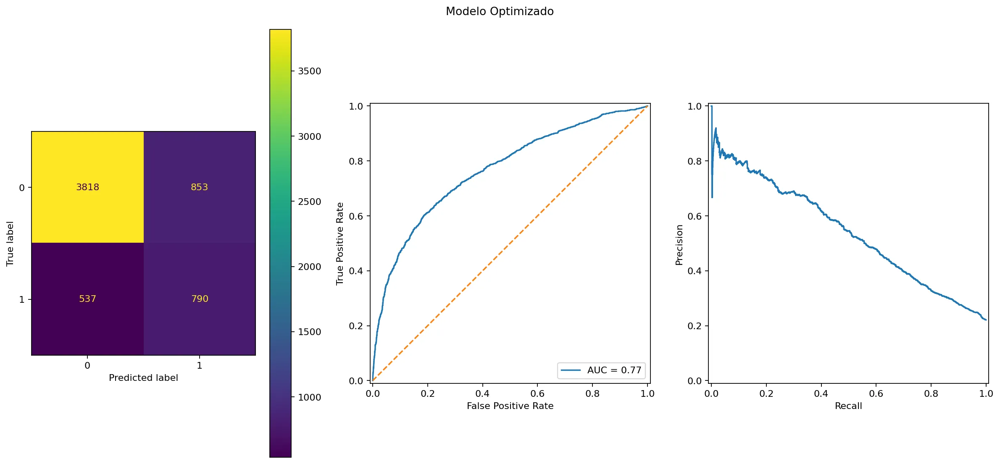
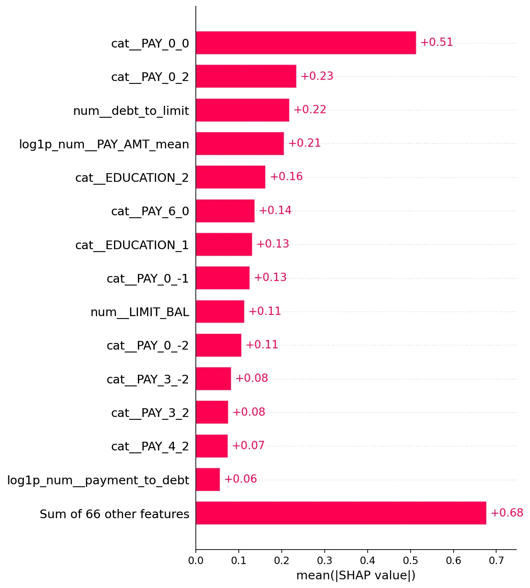
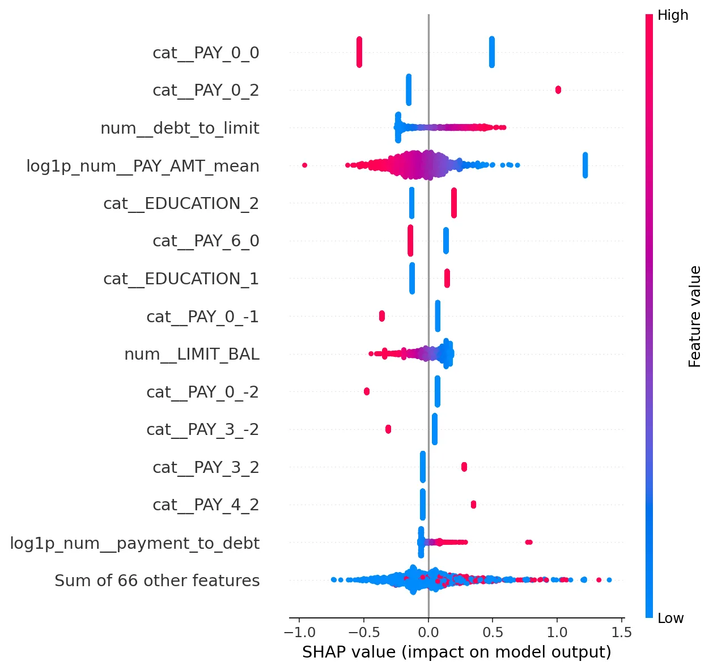

# Credit Default Case Study

Proyecto académico de machine learning sobre el dataset `default_of_credit_card_clients.xls`, enfocado en predecir casos de default/no default en clientes de tarjeta de crédito.

Fuente del repo `https://archive.ics.uci.edu/dataset/350/default+of+credit+card+clients`.

La meta principal no es presentar un notebook con una secuencia larga de pasos, ni optimizar únicamente métricas clásicas como `F1`, `precision` o `precision@80`. El objetivo de este repositorio es mostrar cómo ordenar un proyecto de ML para que el proceso sea reproducible, legible y entregable para un equipo.

## Objetivo

Este proyecto busca demostrar tres cosas:

1. Cómo estructurar un pipeline reproducible de ML.
   El modelo ganador se reconstruye desde `src/credit_default/modeling/train.py`, que abstrae la lógica usada para generar el modelo final y sus artefactos.

2. Cómo separar el trabajo exploratorio del código reutilizable.
   Los notebooks documentan el proceso de 0 a 5, pero la lógica importante vive en módulos bajo `src/credit_default/`. La idea es evitar que el proyecto dependa de un notebook que solo entiende quien lo escribió.

3. Cómo evaluar el modelo más allá de una métrica aislada.
   Además de revisar métricas estándar, se explora el efecto de mover el threshold y se agrega una matriz de utilidad/costo simple para discutir impacto potencial de negocio. Este ejercicio es académico y recreativo: en un caso real habría muchas más variables, restricciones operativas y costos a considerar.

## Alcance

El modelo no debe interpretarse como una solución final lista para producción bancaria. Es una buena aproximación y un punto de partida para detectar con anticipación clientes con mayor riesgo de default.

El valor principal del proyecto está en la plantilla de trabajo: datos, notebooks, features, pipelines, evaluación, checkpoints y un script de entrenamiento final que permite reproducir el resultado seleccionado.

## Flujo Del Proyecto

Los notebooks siguen una secuencia incremental:

```text
00_data_audit.ipynb          Revisión inicial del dataset.
01_baselinea.ipynb           Línea base y primeras referencias de desempeño.
02_feature_engineering.ipynb Limpieza, transformaciones y construcción de variables.
03_train_pipelines.ipynb     Entrenamiento de pipelines candidatos.
04_model_evaluation.ipynb    Comparación y evaluación de modelos.
05_model_optimizacion.ipynb  Optimización final y análisis de thresholds.
```

El script `train.py` toma la versión consolidada del proceso y genera los artefactos finales en `models_one_click/`.

## Entrenamiento Reproducible

Para reconstruir el modelo final:

```bash
python src/credit_default/modeling/train.py
```

El script carga el checkpoint final, reconstruye el pipeline ganador con `build_logistic_regression_pipeline_np1log_optimized`, entrena el modelo y guarda los resultados en `models_one_click/`.

Artefactos generados:

```text
models_one_click/
├── modelo_final.joblib
├── threshold.json
├── final_model_metrics.json
├── threshold_test_results_df.csv
├── modelo_optimizado.webp
├── shap_bar.webp
└── shap_beeswarm.webp
```

## Interpretación Del Modelo

El modelo se evalúa considerando que el problema no siempre se resuelve maximizando una sola métrica. En un caso de default, subir o bajar el threshold puede cambiar de forma importante el recall, los falsos negativos y el volumen de casos marcados como riesgo.



Por eso se incluye una evaluación de thresholds y una matriz simple de utilidad:

```text
profit = tp * beneficio_tp
       + tn * beneficio_tn
       - fp * costo_fp
       - fn * costo_fn
```

Esta matriz no representa una política real de negocio. Sirve para mostrar que las decisiones del modelo deberían discutirse en términos de impacto, no solo en términos de métricas técnicas.

Resultados completos de thresholds bajo la matriz de utilidad académica:

| Threshold |    F1 | Accuracy | Precision | Recall | ROC AUC | PR AUC |   TN |   FP |  FN |   TP |  Profit |
| --------: | ----: | -------: | --------: | -----: | ------: | -----: | ---: | ---: | --: | ---: | ------: |
|      0.30 | 0.429 |    0.473 |     0.282 |  0.895 |   0.768 |  0.541 | 1650 | 3021 | 139 | 1188 | 3179000 |
|      0.35 | 0.463 |    0.587 |     0.325 |  0.804 |   0.768 |  0.541 | 2456 | 2215 | 260 | 1067 | 2976000 |
|      0.25 | 0.398 |    0.364 |     0.252 |  0.953 |   0.768 |  0.541 |  917 | 3754 |  63 | 1264 | 2853000 |
|      0.40 | 0.500 |    0.677 |     0.380 |  0.729 |   0.768 |  0.541 | 3095 | 1576 | 360 |  967 | 2754000 |
|      0.20 | 0.375 |    0.276 |     0.232 |  0.983 |   0.768 |  0.541 |  351 | 4320 |  23 | 1304 | 2321000 |
|      0.45 | 0.521 |    0.736 |     0.435 |  0.650 |   0.768 |  0.541 | 3551 | 1120 | 465 |  862 | 2091000 |
|      0.15 | 0.364 |    0.230 |     0.223 |  0.995 |   0.768 |  0.541 |   61 | 4610 |   6 | 1321 | 1996000 |
|      0.10 | 0.362 |    0.222 |     0.221 |  0.999 |   0.768 |  0.541 |    8 | 4663 |   1 | 1326 | 1965000 |
|      0.50 | 0.532 |    0.768 |     0.481 |  0.595 |   0.768 |  0.541 | 3818 |  853 | 537 |  790 | 1545000 |
|      0.55 | 0.527 |    0.785 |     0.514 |  0.541 |   0.768 |  0.541 | 3992 |  679 | 609 |  718 |  813000 |
|      0.60 | 0.518 |    0.797 |     0.546 |  0.492 |   0.768 |  0.541 | 4128 |  543 | 674 |  653 |  110000 |
|      0.65 | 0.515 |    0.806 |     0.578 |  0.464 |   0.768 |  0.541 | 4221 |  450 | 711 |  616 | -259000 |
|      0.70 | 0.493 |    0.810 |     0.604 |  0.416 |   0.768 |  0.541 | 4309 |  362 | 775 |  552 | -1043000 |
|      0.75 | 0.479 |    0.817 |     0.646 |  0.381 |   0.768 |  0.541 | 4394 |  277 | 822 |  505 | -1578000 |
|      0.80 | 0.445 |    0.817 |     0.675 |  0.332 |   0.768 |  0.541 | 4459 |  212 | 887 |  440 | -2423000 |
|      0.85 | 0.370 |    0.809 |     0.684 |  0.254 |   0.768 |  0.541 | 4515 |  156 | 990 |  337 | -3856000 |

La misma tabla se genera como CSV en `models_one_click/threshold_test_results_df.csv`.

## Interpretabilidad Con SHAP

Además de las métricas y thresholds, el pipeline genera dos visualizaciones SHAP para revisar cómo está usando las variables el modelo final. Estas gráficas explican el comportamiento del modelo, no prueban causalidad.



El gráfico de barras resume la importancia global promedio de las features transformadas. Como el pipeline usa `OneHotEncoder`, algunas variables categóricas aparecen expandidas. Por ejemplo, `cat__PAY_0_0` representa el indicador one-hot para clientes con `PAY_0 = 0`, interpretado en este proyecto como sin atraso registrado en septiembre de 2005. `cat__PAY_0_2` representa `PAY_0 = 2`, es decir, retraso de dos meses en el primer mes observado; categorías mayores indican atrasos más largos.



El beeswarm muestra la distribución del impacto SHAP por observación. Esto ayuda a ver no solo qué variables pesan más, sino también si valores altos o bajos tienden a empujar la predicción hacia mayor o menor riesgo de default.

## Nota Sobre VIF

Durante el feature engineering se utilizó VIF como herramienta de diagnóstico para reducir multicolinealidad entre variables numéricas. Esta decisión es especialmente útil para la regresión logística final, donde features altamente correlacionadas pueden volver inestables los coeficientes y dificultar la interpretación.

Para modelos basados en árboles, como XGBoost, VIF no es un requisito técnico. XGBoost puede trabajar con variables correlacionadas sin sufrir el mismo problema que un modelo lineal. En este proyecto se mantuvo el subconjunto filtrado por VIF como una decisión de consistencia: comparar modelos sobre una base común de features y mantener el pipeline compacto.

Por lo tanto, VIF no debe interpretarse como una condición necesaria para XGBoost, sino como una decisión de reducción de redundancia que encaja mejor con el modelo logístico seleccionado como ganador.

## Estructura Del Repositorio

```text
DefaultUCICredit/
├── data/
│   └── default_of_credit_card_clients.xls
├── Notebooks/
│   ├── 00_data_audit.ipynb
│   ├── 01_baselinea.ipynb
│   ├── 02_feature_engineering.ipynb
│   ├── 03_train_pipelines.ipynb
│   ├── 04_model_evaluation.ipynb
│   ├── 05_model_optimizacion.ipynb
│   └── archive/
│       └── first_book.ipynb
├── src/
│   └── credit_default/
│       ├── data.py
│       ├── features.py
│       ├── evaluation.py
│       ├── utils.py
│       └── modeling/
│           ├── optimization.py
│           ├── pipelines.py
│           └── train.py
├── checkpoints/
│   └── vif_checkpoint/
│       ├── X_train.parquet
│       ├── X_test.parquet
│       ├── y_train.parquet
│       ├── y_test.parquet
│       └── metadata.json
├── models/
│   ├── logistic_np1log/
│   ├── logistic_simple/
│   ├── propposed_model/
│   └── xgboost/
├── models_one_click/
│   ├── modelo_final.joblib
│   ├── threshold.json
│   ├── final_model_metrics.json
│   ├── threshold_test_results_df.csv
│   ├── modelo_optimizado.webp
│   ├── shap_bar.webp
│   └── shap_beeswarm.webp
├── reports/
│   └── tables/
├── requirements.txt
└── README.md
```

## Instalación

```bash
python -m venv .venv
source .venv/bin/activate
pip install -r requirements.txt
```

## Notas

Este no es un proyecto de analytics descriptivo sobre segmentos bancarios. El foco está en el flujo de trabajo de ML: cómo ordenar el análisis, convertirlo en código reutilizable y dejar una ruta clara para reproducir el modelo seleccionado.

Las optimizaciones futuras pueden continuar en los notebooks 04 y 05, pero la entrega actual prioriza una plantilla clara y ejecutable.
